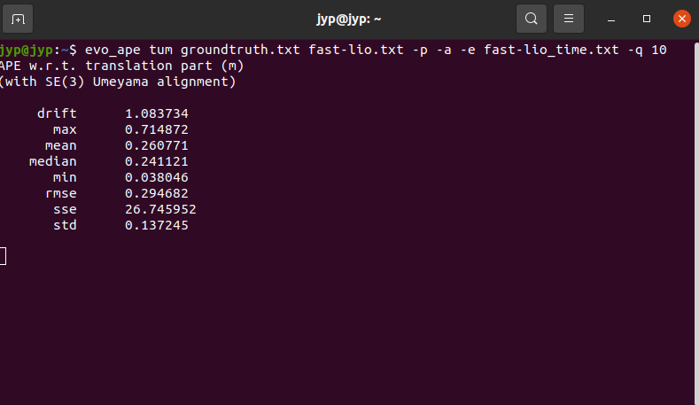
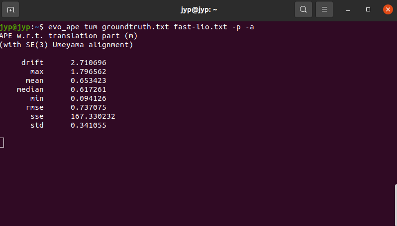
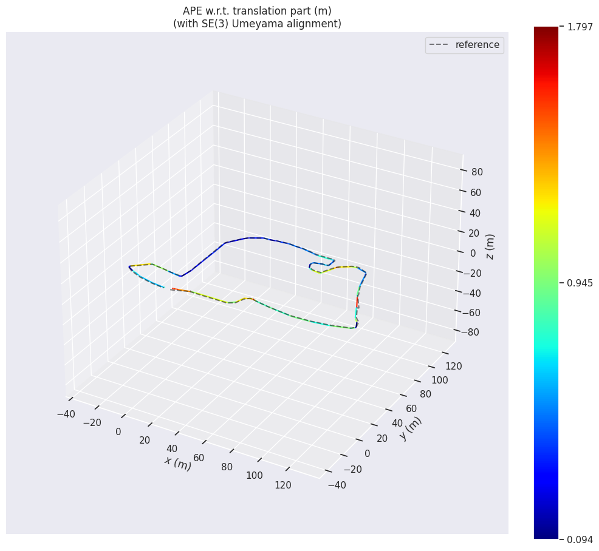

# EA-evo 

We developed EA-evo based on the widely used SLAM accuracy evaluation tool [evo](https://github.com/MichaelGrupp/evo), integrating our novel Efficiency-Aware Drift ([EA-Drift](https://yaepiii.github.io/M2UD//ea-drift/)) metric into the original evo code. This enhancement provides a more comprehensive evaluation by considering both accuracy and efficiency, which contributes for researchers to choose a more suitable SLAM algorithm for practical applications.

EA-Drift is defined: 

$$
EA\text{-}Drift := \frac{\sqrt{\sum_{i=1}^{n} e^{\frac{t_i - \frac{1}{f}}{f}} \lVert P_{i}^{-1}SQ_i \rVert^2 }}{L}
$$

where, $$S$$ represents the rigid body transformation obtained as the least squares solution that aligns the estimated trajectory $$P_{1:n}$$ to the ground truth trajectory $$Q_{1:n}$$, solved in closed form using the Horn method and automatically aligned using evo, $$L$$ is estimated path length, $$t_i$$ represents the time consumption of frame $$i$$ in ms, and $$f$$ indicates the sensor frequency.

## :gear: Installation / Upgrade

First, ensure that evo is correctly installed by following the official installation instructions. Verify that it functions properly before proceeding.

### 1. evo installation

Installation is easy-peasy if you're familiar with this: https://xkcd.com/1987/#

evo supports **Python 3.8+**.
You might also want to use a [virtual environment](https://github.com/MichaelGrupp/evo/blob/master/doc/install_in_virtualenv.md).

#### From PyPi
If you just want to use the executables of the latest release version, the easiest way is to run:
```bash
pip install evo --upgrade --no-binary evo
```
This will download the package and its dependencies from [PyPI](https://pypi.org/project/evo/) and install or upgrade them. Depending on your OS, you might be able to use `pip2` or `pip3` to specify the Python version you want. Tab completion for Bash terminals is supported via the [argcomplete](https://github.com/kislyuk/argcomplete/) package on most UNIX systems - open a new shell after the installation to use it (without `--no-binary evo` the tab completion might not be installed properly). If you want, you can subscribe to new releases via https://libraries.io/pypi/evo.

#### From Source
Run this in the repository's base folder:
```bash
pip install --editable . --upgrade --no-binary evo
```

### 2. EA-evo installation

Next, locate the evo installation directory by `which evo`. Typically, evo can be found in:
```
/usr/local/lib/python3.8/dist-packages/
```
However, the exact path may vary depending on your Python version and environment.

Then, copy several files from **EA-evo** to the **evo** installation directory to override the original **evo** code:
```
sudo cp EA-evo/main_ape* /usr/local/lib/python3.8/dist-packages/evo/
sudo cp EA-evo/core/metrics.py /usr/local/lib/python3.8/dist-packages/evo/core/
sudo cp EA-evo/tools/settings_template.py /usr/local/lib/python3.8/dist-packages/evo/tools/
```

Congratulations! You have successfully installed EA-evo and integrated it with evo.

## :wrench: Dependencies

**Python packages**

evo has some required dependencies that are ***automatically resolved*** during installation with pip.
They are specified in the `install_requires` part of the `setup.py` file.

**PyQt5 (optional)**

PyQt5 will give you the enhanced GUI for plot figures from the "*Qt5Agg*" matplotlib backend (otherwise: "*TkAgg*"). If PyQt5 is already installed when installing this package, it will be used as a default (see `evo_config show`). To change the plot backend afterwards, run `evo_config set plot_backend Qt5Agg`.

**ROS (optional)**

Some ROS-related features require a ROS installation, see [here](http://www.ros.org/). We are testing this package with ROS Noetic and Iron. Previous versions (`<= 1.12.0`) work with Melodic, Kinetic and Indigo.

*Note:* reading ROS bag files works also without a ROS installation thanks to the great [rosbags](https://pypi.org/project/rosbags/) package that is installed together with evo. This allows you also to read ROS 1 & 2 bags even if you don't have one of those ROS distros installed. (except for reading `/tf` topics, because there we need the buffer implementation from ROS)

---

## :page_facing_up: Command Line Interface

We mainly changed the translation part of `ape` evaluation in evo, if you want to use it, you first need to export a frame-by-frame time consumption file in the format `<timestamp time-consumption(ms)>`, for example:
```
timestamp         time-consumption(ms)
1728879834.075186 19.403937
1728879834.176058 8.700009
1728879834.276914 7.350973
1728879834.377772 4.653661
1728879834.478615 6.128157
1728879834.579524 7.983143
1728879834.680337 6.973045
...
```

Finally, execute the following command to evaluate Efficiency-Aware Drift and APE:
```
evo_ape tum groundtruth.txt your_estimated_trajectory.txt -a -p -e your_time_consumption.txt -q your_sensor_frequency
```

For example, evaluate FAST-LIO2 trajectory with 10Hz LiDAR using EA-evo:
```
evo_ape tum groundtruth.txt fast-lio.txt -a -p -e fast-lio_time.txt -q 10
```

You can download the example file - FAST-LIO2 result in M2UD aggressive_04 sequence - for testing:
- [groundtruth](https://1drv.ms/t/c/c1806c2e19f2193f/EcUltIFn0NlPkdRO4WnEtvgBCdn0vBwsq69uH-pRSIVPdg?e=ey1CqZ)
- [fast-lio trajectory](https://1drv.ms/t/c/c1806c2e19f2193f/EUhT79vyy4NDqz5in09RTF8B5C17Wvqattk5SfWYbMSl3A?e=giCZPd)
- [fast-lio time consumption](https://1drv.ms/t/c/c1806c2e19f2193f/EWi2LCj8yipMlWWO0ACfXWgBX7-5d6iMa1RqWFdEOJmWeQ?e=baGuVf)

---

## :chart_with_upwards_trend: Reulst

If everything is set up correctly, you should see results similar to the following:

<div align=center>

</div>

<div align=center>

</div>

We have integrated Drift rate calculation. If you do not want to use **EA-Drit** and only want to check the **Drift (%)** of SLAM algorithm, you only need to leave the parameters `-e` and `-q` unset.
```
evo_ape tum groundtruth.txt your_estimated_trajectory.txt -a -p
```

<div align=center>

</div>

<div align=center>

</div>

Note that the calculated **Drift** is defined as:

$$
Drift := \frac{\sqrt{\sum_{i=1}^{n} \lVert P_{i}^{-1}SQ_i \rVert^2 }}{L}
$$

where, $$S$$ represents the rigid body transformation obtained as the least squares solution that aligns the estimated trajectory $$P_{1:n}$$ to the ground truth trajectory $$Q_{1:n}$$, solved in closed form using the Horn method and automatically aligned using evo, $$L$$ is estimated path length.

## :green_book: License

[GPL-3.0 or later](https://www.gnu.org/licenses/gpl-3.0.html)

If you use this package for your research, a footnote with the link to this repository is appreciated: `github.com/Yaepiii/M2UD`.

...or, for citation with BibTeX:
```
@misc{grupp2017evo,
  title={evo: Python package for the evaluation of odometry and SLAM.},
  author={Grupp, Michael},
  howpublished={\url{https://github.com/MichaelGrupp/evo}},
  year={2017}
}
```
