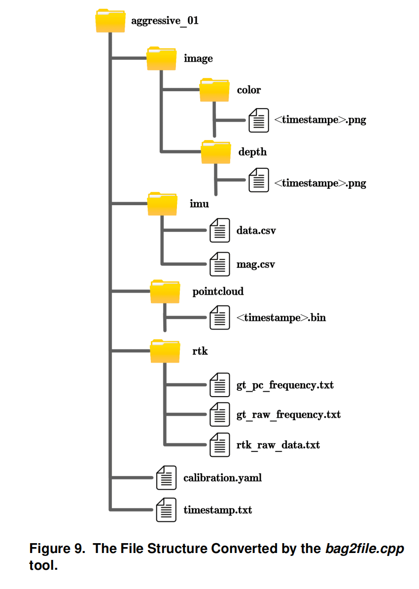

# :hammer: Development Kits

To enhance usability and facilitate evaluation, a series of development kits are also released, which are implemented in C++ and built based on ROS.

## :gear: Dependence

- *Ubuntu20.04* with *ROS neotic*: Install ros following [ROS Installation](http://wiki.ros.org/noetic/Installation/Ubuntu). We use the PCL and Eigen library in ROS.

- *Opencv 4.2.0*: If you installed Ubuntu20.04 and ROS neotic correctly, Opencv 4.2.0 should also be installed correctly.

## :pencil: Build

Clone this repository and build:
```
mkdir m2ud_development_kit_ws/src -p
cd m2ud_development_kit_ws/src
git clone https://github.com/Yanpiii/M2UD.git
cd .. && catkin_make
source devel/setup.bash
```

## :sparkler: Introduction

### 1. Ground Truth Smooth

The groundtruth_`create.cpp` file reads the RTK topic from the bag file and smooths the data. Eventually, it creates a `GTCreate` folder in the same directory and generates four files: timestamps, raw RTK data, smoothed ground truth values at the RTK frequency, and ground truth values at the LiDAR frequency.

You should replace `rosbag_path`, `rosbag_file`, `RTK_topic` in the `launch/groundtruth_create.launch` file with specific parameters.

And run:
```
roslaunch m2ud_development_kit groundtruth_create.launch
```

The results are shown like:

<div align=center>

</div>

### 2. File Format Conversion

The `bag2file.cpp` file reads topics from the bags and converts color images, depth images, and point clouds into 8-bit `.png` files and `.bin` binary files, respectively, naming them based on timestamps. It stores accelerometer, gyroscope, and magnetometer data from the IMU in a `.csv` file, the RTK data and smoothed trajectory ground truth in `.txt` files, and the sensor extrinsic and intrinsic parameters of the recording platform in a `calibration.yaml` file.

You should replace `rosbag_path`, `rosbag_file`, `xxx_topic` in the `launch/bag2file.launch` file with specific parameters.

And run:
```
roslaunch m2ud_development_kit bag2file.launch
```

The results are shown like:

<div align=center>

</div>

### 3. Time Alignment

The `time_align.cpp` file is primarily used to evaluate localization accuracy. Since some algorithms that adopt the keyframe strategy and incorporate a loop closure detection module (e.g., LIO-SAM) may produce sparse trajectories for evaluation, the resulting trajectory may appear discontinuous when compared with the ground truth. This tool interpolates the algorithm’s output based on the timestamps of the ground truth, enabling a more reasonable and continuous evaluation of localization accuracy.

You should replace `groundtruth`, `before_data`, `after_data` in the `launch/time_align.launch` file with specific parameters.

And run:
```
roslaunch m2ud_development_kit time_align.launch
```

The results are shown like:

Before:
<div align=center>

</div>

After:

<div align=center>

</div>

### 4. RTK Topic Publisher

The `RTK_process.cpp` file reads GGA or VTG protocol data from the serial port, then repackages and publishes the original position information, the number of GPS satellites, timestamps, signal quality, and other relevant data as RTK ROS topics.

And run:
```
roslaunch m2ud_development_kit RTK_process.launch
```

### 5. Localization Evaluation

To facilitate the evaluation of localization accuracy using the novel metric-"[EA-Drift](https://yaepiii.github.io/M2UD//ea-drift/)", we modify the widely used trajectory evaluation tool evo in SLAM and introduce [EA-evo](https://github.com/Yaepiii/M2UD/tree/main/m2ud_development_kit/EA-evo). Users first need to export a frame-by-frame time consumption file in the format `<timestamp time-consumption>`. 

See this [link](https://github.com/Yaepiii/M2UD/tree/main/m2ud_development_kit/EA-evo) for more details on how to use it


